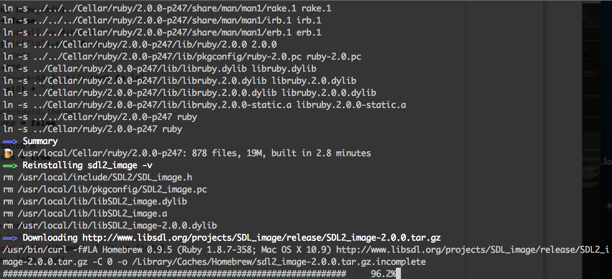
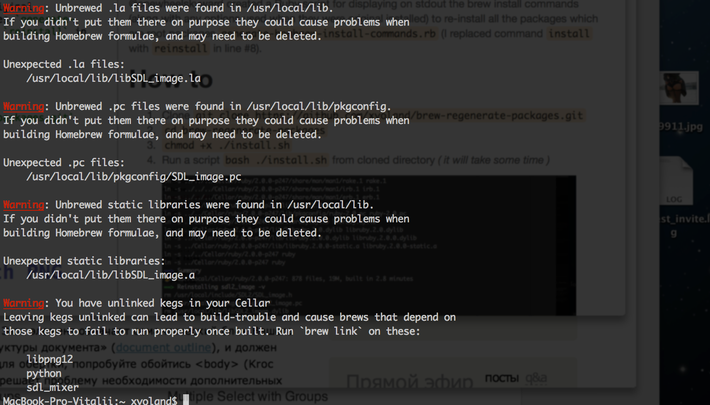

# Upgrade brew packages from Mac OS X 10.8 to 10.9 Mavericks

If you've upgraded to 10.9 (Mac OSX Mavericks) from an earlier version (OSX 10.8 Mountain Lion) - because the default C++ standard library is now libc++, you may not be able to build software using dependencies that you built on 10.8 or lower. If you're reading this page because you were directed here by a build error, you can most likely fix the issue if you reinstall all the dependencies of the package you're trying to build.

@onewheelskyward created a Ruby script for displaying on stdout the brew install commands (along with any options used when they were original installed) to re-install all the packages which are root packages `generate-hombrew-install-commands.rb` (I replaced command `install` with `reinstall` in line #8).

# How to

1. Clone `git clone https://github.com/xvoland/brew-regenerate-packages.git`
2. `cd brew-regenerate-packages`
3. `chmod +x ./install.sh`
4. Run a script `bash ./install.sh` from cloned directory
	_( it will take some time )_

	
5. After `brew doctor` I got some errors, but this is easily remedied by following the instructions `brew`

6. `brew prune`
7. `brew link --overwrite --dry-run libpng12`
8. `brew link sdl_mixer`
9. Enjoy the results

